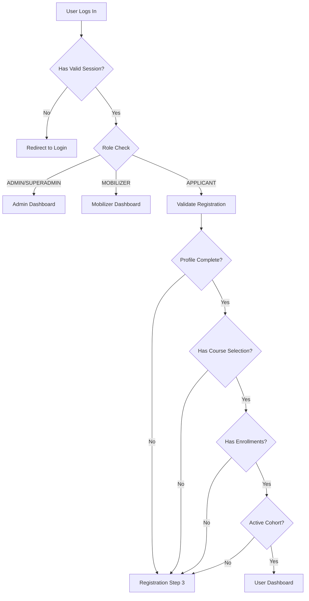

# Login Flow Validation Enhancement - October 28, 2025

## Overview

Enhanced the user login flow to properly validate registration completion and redirect users to appropriate screens based on their profile and enrollment status.

## What Was Fixed

### 1. **Enhanced Role-Based Redirection Logic**

**Before**: Simple check for profile existence
```typescript
case 'APPLICANT':
  return session?.userData?.profile
    ? { redirect: { destination: `/dashboard` } }
    : { redirect: { destination: `/register-new?step=3` } };
```

**After**: Comprehensive validation of registration completion
```typescript
case 'APPLICANT':
  const validationResult = await validateUserRegistrationStatus(session.userData.userId);
  
  if (validationResult.isComplete) {
    return { redirect: { destination: `/dashboard` } };
  } else {
    return { redirect: { destination: `/register-new?step=3` } };
  }
```

### 2. **Comprehensive Registration Status Validation**

Created `validateUserRegistrationStatus()` function that checks:

#### **Profile Completeness**
- Essential fields required: `phoneNumber`, `gender`, `ageRange`, `stateOfResidence`, `educationLevel`
- Course selection: `selectedCourseName`, `selectedCourseId`

#### **Enrollment Status**
- User must have at least one enrollment record
- User must be associated with an active cohort
- Enrollments must be properly linked via `UserCohort`

#### **Data Integrity**
- Profile exists and is properly linked
- User cohort relationships are valid
- Course selection data is complete

### 3. **Detailed Logging and Diagnostics**

Added comprehensive logging to track:
- User validation results
- Missing profile fields
- Enrollment status
- Cohort activation status

## User Flow After Login



## Registration Step 3: Personal Information

When users are redirected to `register-new?step=3`, they land on the **Personal Information** step, which allows them to:

1. Complete missing profile fields
2. Select or confirm course choices
3. Finalize registration details
4. Trigger enrollment process

## Benefits

### **1. Prevents Incomplete Registrations**
- Users can't access dashboard with incomplete profiles
- Ensures all required data is collected before proceeding

### **2. Handles Course Selection Issues**
- Addresses the course selection bug mentioned in `COURSE_SELECTION_FIX.md`
- Users who lost course selection data get redirected to complete it

### **3. Enrollment Validation**
- Ensures users have proper enrollments before dashboard access
- Prevents dashboard errors from missing enrollment data

### **4. Better User Experience**
- Clear redirection to the correct step in registration
- Users understand what they need to complete
- No more blank dashboard screens for incomplete users

## Files Modified

- **`pages/role.tsx`**: Added comprehensive validation logic
- Enhanced authentication flow with detailed status checking

## Monitoring & Validation

### **Log Messages to Watch**
```
🔍 User [email] validation result: { isComplete: true/false, reason: "..." }
⚠️ User [email] needs to complete registration: [reason]
```

### **Expected Behaviors**
1. **Complete Users**: Direct access to dashboard
2. **Incomplete Users**: Redirected to registration step 3
3. **New Users**: Follow normal registration flow

### **Common Scenarios**
- **Missing Profile Data**: Redirect to step 3 for completion
- **No Course Selection**: Redirect to step 3 to select course
- **No Enrollments**: Redirect to step 3 to trigger enrollment
- **Inactive Cohort**: Redirect to step 3 for cohort assignment

## Testing Recommendations

1. **Test with Incomplete Users**: Verify they get redirected to step 3
2. **Test with Complete Users**: Verify they access dashboard directly
3. **Monitor Validation Logs**: Check for common missing fields
4. **Verify Registration Flow**: Ensure step 3 properly completes registration

---

**Status**: ✅ Implemented and Ready for Testing  
**Impact**: Improved user onboarding and registration completion  
**Next**: Monitor user flows and adjust validation criteria as needed
